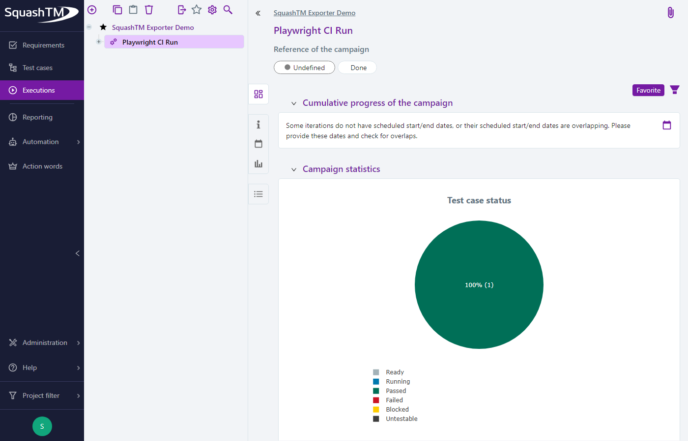

# E-commerce QA Automation Framework

*Playwright + TypeScript, Page Object Model, with enterprise
test-management reporting.*

A Playwright + TypeScript end-to-end and API test suite built against
[automationexercise.com](https://automationexercise.com), a public
practice site for QA engineers. Built as a portfolio piece to demonstrate
the same patterns used in production test suites: Page Object Model,
environment-driven config, custom fixtures, and CI integration.

Beyond the test suite itself, this repo also ships a results-reporting
pipeline: Playwright JSON output converted — and optionally pushed live —
into SquashTM, an enterprise test-management tool, verified end-to-end
against a real self-hosted instance rather than assumed from
documentation. See [Test Reporting](#test-reporting).

## Why these choices

- **Page Object Model** — each page's locators and actions live in one
  class (`src/pages/`). Tests read as user behaviour ("log in", "add to
  cart"), not raw selectors, so a UI change means updating one page object
  instead of every test that touches that screen.
- **Custom fixtures** (`src/fixtures/pageFixtures.ts`) — page objects are
  injected automatically into every test, removing repetitive setup code
  from spec files.
- **Data factory, not hardcoded fixtures** (`src/data/testDataFactory.ts`)
  — signup requires a unique email per run; generating fresh data avoids
  flaky "email already exists" failures on repeated CI runs.
- **Environment config** (`src/config/env.ts`) — base URLs come from
  environment variables, so the same suite can point at a different
  environment (staging, a fork of the demo site, etc.) without code
  changes.
- **API tests alongside UI tests** (`tests/api/`) — faster feedback for
  backend-only regressions, and proof the suite isn't only UI-deep.

## Project structure

```
├── src/
│   ├── config/           # environment config
│   ├── data/             # test data factories
│   ├── fixtures/         # custom Playwright fixtures (page objects)
│   ├── pages/             # Page Object Model classes
│   └── reporting/
│       └── squashtm-exporter/  # Playwright JSON report -> SquashTM CSV converter
├── tests/
│   ├── e2e/               # UI end-to-end specs
│   └── api/               # API-level specs
├── docs/
│   └── BUG_LOG.md          # real issues found while building this suite
└── .github/workflows/      # CI pipeline
```

## Setup

```bash
npm install
npx playwright install --with-deps
cp .env.example .env
```

## Running tests

```bash
npm test                 # full suite, all browsers
npm run test:chromium    # single browser
npm run test:e2e         # UI specs only
npm run test:api         # API specs only
npm run test:unit        # Jest unit tests (src/reporting/squashtm-exporter)
npm run test:ui          # Playwright's interactive UI mode
npm run report           # open the last HTML report
```

Or `npm run launch` for an interactive menu over all of the above (plus
the SquashTM export/push commands) — colored live output, and every run
also saved as a plain-text log under `logs/` (gitignored) so you don't
need to have kept the terminal scrollback.

## Test Reporting

`src/reporting/squashtm-exporter/` converts a Playwright JSON test report
into a CSV file formatted for import into SquashTM, an enterprise test
management tool, and can optionally push those same results live to a
real SquashTM instance over its REST API — see
[its README](src/reporting/squashtm-exporter/README.md) for the full
design, the column/status mapping, and a from-the-source writeup of
SquashTM's actual REST API (auth, endpoints, real constraints), verified
against a self-hosted instance (`squashtm/`, a throwaway local
docker-compose stack) rather than assumed from documentation alone.

```bash
npm run export:squashtm            # writes squashtm-import.csv at the repo root
npm run export:squashtm -- --push  # also pushes live — needs SQUASHTM_* env vars, see .env.example
```

**`npm test` will also auto-push, locally, if configured.** A `posttest`
npm lifecycle script (`scripts/push-squashtm-if-configured.js`) runs
right after `npm test` finishes and, only if `SQUASHTM_*` env vars are
set, pushes results live — no extra command needed. Not set → it no-ops
with a one-line note. This never runs in CI (CI calls `npx playwright
test` directly, not `npm test`) and is scoped to chromium's results only,
because of the batch-uniqueness limitation below.

Its own unit tests run separately from the Playwright suite, via Jest
(`npm run test:unit`) — see [`jest.config.js`](jest.config.js), scoped to
just that module.

### Real output

`squashtm-import.csv`, from an actual `npm run export:squashtm` run against
this repo's own suite (full CSV has 39 rows — one per test × browser):

```csv
TEST_CASE_REFERENCE,TEST_CASE_NAME,STATUS,EXECUTION_DATE,DURATION_MS,COMMENT
TC-110,[TC-110] GET productsList returns 200 with a product array,SUCCESS,2026-09-13T16:03:30.899Z,1129,
TC-101,[TC-101] a signed-up user can place an order end to end,SUCCESS,2026-09-13T16:03:44.272Z,16824,
TC-102,[TC-102] checkout blocks submission when the card number is missing,SUCCESS,2026-09-13T16:03:51.076Z,11648,
TC-103,[TC-103] searching for a term with no matches shows zero results,SUCCESS,2026-09-13T16:04:01.122Z,3833,
```

**Live push, proven**: the screenshot below is a real result from this
repo's own suite landing in a real SquashTM campaign, taken right after
running `npm run export:squashtm -- --push` against the local
`squashtm/` instance — not a mock, and not staged from the sample
fixture.



One real constraint this surfaced: SquashTM's import endpoint rejects a
batch that has the *same* reference more than once (`"The reference and
dataset name combination must be unique"`) — so pushing the full
multi-browser CSV in one call (each test case appears 3×, once per
browser) fails outright. The screenshot above is from a single-browser
(`--project=chromium`) run instead. This is a real, current limitation of
`--push` with this repo's multi-browser suite, not yet worked around in
code — see the module's README for the full detail.

## CI

Every push and pull request to `main` runs the full suite across
Chromium, Firefox, and WebKit via GitHub Actions
(`.github/workflows/ci.yml`), with the HTML report uploaded as a build
artifact.

## Known limitations

- A handful of locators (flagged in code comments) are matched against the
  site's DOM structure directly, since `automationexercise.com` doesn't
  expose `data-qa` hooks on every element (e.g. product tiles, the cart
  quantity cell). These are the more brittle of the two approaches and the
  most likely to need re-verifying if the site's markup changes — run
  `npm run codegen` against the live site to re-check if tests start
  failing unexpectedly.
- This is a demo/practice site with a dummy payment gateway — the checkout
  test verifies the real post-payment confirmation page reached by the
  live flow (see `docs/BUG_LOG.md` BUG-002 for why that's not the message
  the static payment page HTML suggests you'd assert on). The gateway also
  has no real field validation beyond the browser's native "required"
  check — a present-but-invalid card number is accepted outright (BUG-005)
  — so the sad-path checkout test targets the one behaviour that's
  actually enforced (a missing card number), not card-format validation
  that doesn't exist.
- `automationexercise.com` is a shared public site, not an isolated test
  environment — it noticeably slows down or hangs requests under heavy
  concurrent load from a single source. `playwright.config.ts` caps
  `workers` at 2 and allows one retry outside CI for this reason; see the
  comment there and the infra note at the bottom of `docs/BUG_LOG.md`
  before raising either value.

## Bugs found

See [`docs/BUG_LOG.md`](docs/BUG_LOG.md) for real issues discovered while
building and running this suite.
